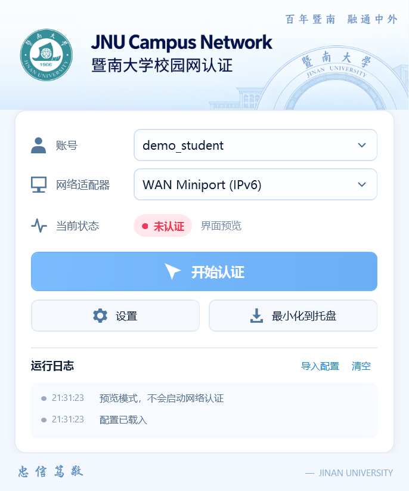
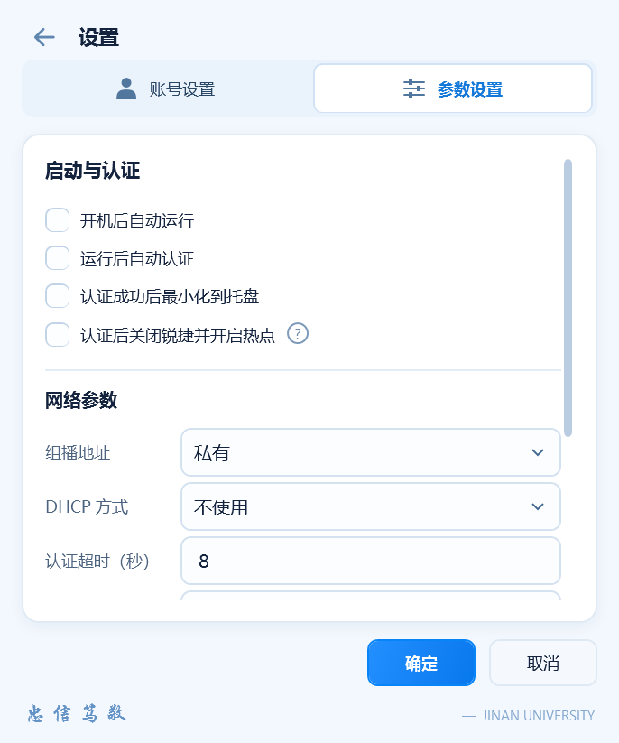

# MentoHUST Windows JNU BetterUI

为暨南大学锐捷 6.61 认证环境提供 WPF 桌面界面，基于 [Hjdd14/mentohust-windows-jnu](https://github.com/Hjdd14/mentohust-windows-jnu) 开发。通过独立 C++ 后台复用原认证核心，账号与参数继续兼容旧配置。

## 界面

| 首页 | 参数设置 |
| --- | --- |
|  |  |

## 功能

- 单窗口首页与设置页，圆角控件、柔和图标、高清页眉和校徽；程序、窗口及托盘使用官网 SVG 生成的透明多尺寸图标。
- 平滑切页、滑动标签与复选框过渡；动画结束清理资源，保留键盘操作。
- 账号管理只填写账号和密码，网卡选择、认证状态及运行日志同步显示。
- 旧版 INI 导入、草稿取消、兼容保存、外部修改检测和上一份配置备份。
- 手动开始／断开认证；认证成功后可等待半秒收起到托盘。
- 当前用户开机登录运行，点击设置页“确定”后生效。
- 可选认证后结束 `8021x.exe` 一次并启动 Windows 移动热点，问号提供说明。

## 下载与使用

从本仓库的 [Releases](https://github.com/1nvincibleZz/mentohust-windows-jnu-BetterUI/releases) 下载 `MentoHUST-BetterUI-*.zip`，解压到固定目录，运行 `MentoHUST.BetterUI.exe`。同目录的 `MentoHUST.Engine.exe` 是认证后台。

1. 安装兼容 pcap 的抓包驱动；使用 Npcap 时启用 WinPcap API 兼容模式。
2. 第一次使用可点击“导入配置”选择旧客户端的 `Config.ini`，或在设置中添加账号。填写后点击“添加／更新”，再点击“确定”。
3. 选择有效账号和网卡，点击“开始认证”。
4. 需要开机运行时勾选“开机后自动运行”并保存；下次登录 Windows 打开客户端。取消勾选并保存可关闭。
5. 需要认证后开启热点时勾选对应选项并保存，执行结果显示在日志中。

配置位于 `%LOCALAPPDATA%\MentoHUST.Wpf\Config.ini`。导入后使用独立副本，原配置文件保留；发布包不包含账号或密码。关闭 WPF 窗口会退出其私有后台，点击“断开认证”才执行原认证核心的断开操作。

当前运行后由用户手动开始认证，“运行后自动认证”仅保存配置，尚未接通。开机运行只登记当前用户的独立启动项，不修改其他程序的启动项。热点需要 Windows 接口、无线网卡、所选网卡的 Internet 连接和相应权限，名称／密码沿用系统设置；每次手动认证只尝试一次。

当前在 Windows 11、.NET Framework 和已有抓包驱动环境验证；后台需要 x86 VC／MFC 运行库。用户已反馈认证、热点及界面交互正常，实际 Windows 登录启动尚待验收，其他机器与校园网环境需分别验证。

## 构建

已有 Windows .NET Framework 4.x 编译器时，用 PowerShell 构建前端；后台需要 Visual Studio C++、MFC x86 工具链和 Windows SDK。将 `VisualStudioRoot` 改为本机安装目录：

```powershell
pwsh -File .\desktop-wpf\build-preview.ps1
pwsh -File .\desktop-wpf\build-engine.ps1 -VisualStudioRoot 'D:\MicrosoftVisualStudio'
.\desktop-wpf\bin\EngineTrial\MentoHUST.Desktop.Preview.exe
```

脚本的开发输出保留 `MentoHUST.Desktop.Preview.exe` 文件名，正常运行会连接认证后台；`--preview` 才是只在内存中操作的离线界面预览。发布包采用 `MentoHUST.BetterUI.exe` 文件名，两者使用同一前端。

另提供 .NET 8 Windows 工程：

```powershell
dotnet build .\desktop-wpf\MentoHUST.Desktop.csproj
```

当前验证的是 .NET Framework 构建路径，.NET 8 SDK 构建尚未在本机验证。

## 开发与验证

- [WPF 构建、功能和检查命令](desktop-wpf/README.md)
- [认证后台桥接与迁移边界](desktop-wpf/MIGRATION.md)
- [界面素材来源](desktop-wpf/Assets/README.md)
- [本版更新内容](CHANGELOG.md)

原 `VS2012/MentoHUST` 工程与认证核心保留，`references/` 是历史参考。原 Windows MentoHUST 来源见 [Google Code 存档](https://code.google.com/archive/p/mentohust/issues/51)。
